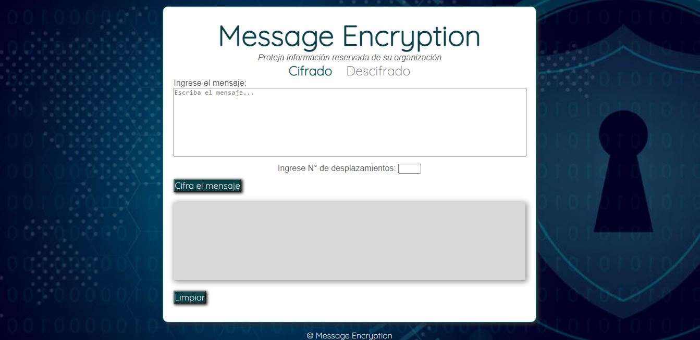
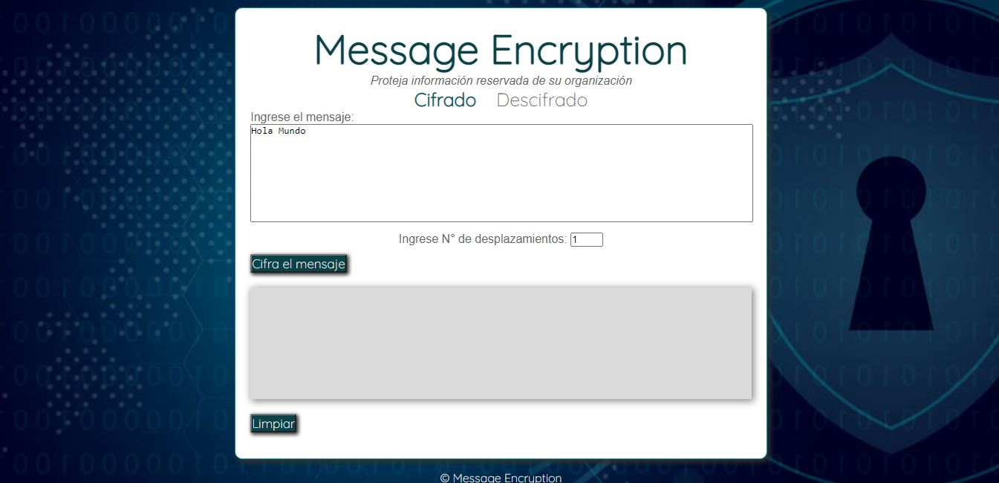
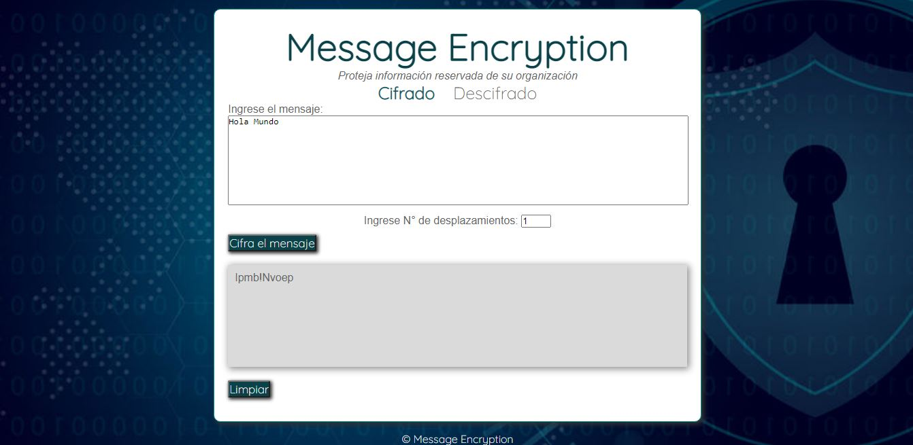
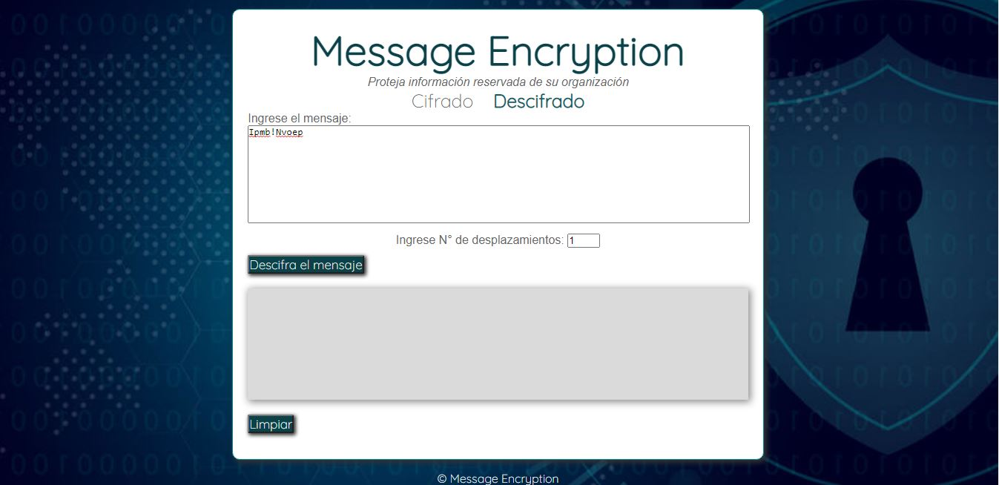
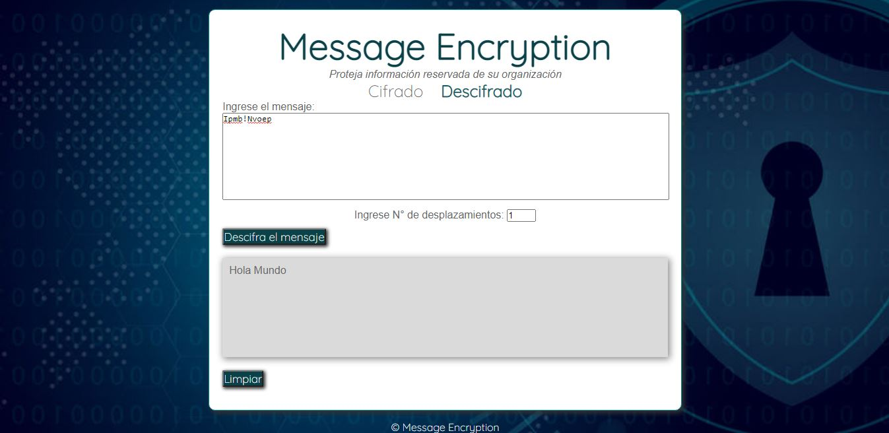
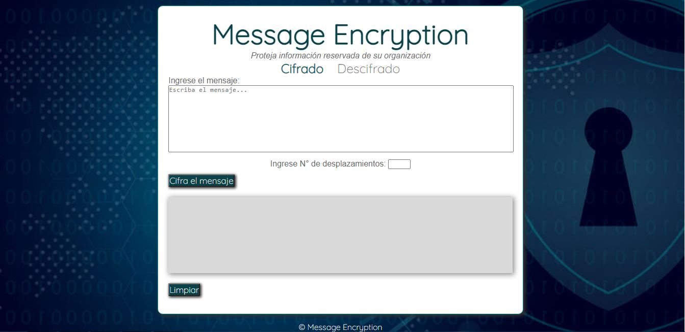

# Message Encryption - Cifrado César

## Índice

* [1. Preámbulo](#1-preámbulo)
* [2. Resumen del proyecto](#2-resumen-del-proyecto)
* [3. Objetivos de aprendizaje](#3-objetivos-de-aprendizaje)
* [4. Criterios que cumple el proyecto](#4-criterios-que-cumple-el-proyecto)
* [5. Funcionalidad del proyecto](#5-funcionalidad-del-proyecto)

***

## 1. Preámbulo

Cifrar significa codificar. El aplicativo web "Message Encryption" esta inspirado en el método del Cifrado César.

El [cifrado César](https://en.wikipedia.org/wiki/Caesar_cipher)
es uno de los primeros métodos de cifrado conocidos. El emperador romano Julio
César lo usaba para enviar órdenes secretas a sus generales en los campos de
batalla.


El cifrado césar es una de las técnicas más simples para cifrar un mensaje. Es
un tipo de cifrado por sustitución, es decir que cada letra del texto original
es reemplazada por otra que se encuentra un número fijo de posiciones
(desplazamiento) más adelante en el mismo alfabeto.

Por ejemplo, si usamos un desplazamiento (_offset_) de 3 posiciones:

* La letra A se cifra como D.
* La palabra CASA se cifra como FDVD.
* Alfabeto sin cifrar: A B C D E F G H I J K L M N O P Q R S T U V W X Y Z
* Alfabeto cifrado: D E F G H I J K L M N O P Q R S T U V W X Y Z A B C

En la actualidad, todos los cifrados de sustitución simple se descifran con
mucha facilidad y, aunque en la práctica no ofrecen mucha seguridad en la
comunicación por sí mismos; el cifrado César sí puede formar parte de sistemas
más complejos de codificación, como el cifrado Vigenère, e incluso tiene
aplicación en el sistema ROT13.

## 2. Resumen del proyecto

En este proyecto se desarrolla una aplicación web que sirve para que el usuario pueda cifrar y descifrar un texto indicando un desplazamiento específico de caracteres (_offset_).
Está orientada a organizaciones no gubernamentales que defiendan derechos humanos de personas vulnerables en zonas de conflicto armado donde se requiera mantener en reserva mensajes para el cuidado de objetivos de la organización. 


## 3. Objetivos de aprendizaje

En la construcción de esta aplicación web se aplicó la interactividad entre HTML, CSS y Javascript para dar como resultado final un producto correctamente definido para el usuario final.

### HTML y CSS

* [x] [Uso de HTML semántico.](https://developer.mozilla.org/en-US/docs/Glossary/Semantics#Semantics_in_HTML)
* [x] Uso de selectores de CSS.

### DOM

* [x] Uso de selectores del DOM.
* [x] Manejo de eventos del DOM.
* [x] [Manipulación dinámica del DOM.](https://developer.mozilla.org/es/docs/Referencia_DOM_de_Gecko/Introducci%C3%B3n)
(appendChild |createElement | createTextNode| innerHTML | textContent | etc.)

### JavaScript

* [x] Manipulación de strings.
* [x] Uso de condicionales (if-else | switch | operador ternario)
* [x] Uso de bucles (for | for..in | for..of | while)
* [x] Uso de funciones (parámetros | argumentos | valor de retorno)
* [x] Declaración correcta de variables (const & let)

### Testing

* [x] [Testeo unitario.](https://jestjs.io/docs/es-ES/getting-started)

El test pasa con los siguientes resultados:

```text
-----------|---------|----------|---------|---------|-------------------
File       | % Stmts | % Branch | % Funcs | % Lines | Uncovered Line #s
-----------|---------|----------|---------|---------|-------------------
All files  |     100 |    95.45 |     100 |     100 |                  
 cipher.js |     100 |    95.45 |     100 |     100 | 40,94            
-----------|---------|----------|---------|---------|-------------------
Test Suites: 1 passed, 1 total
Tests:       17 passed, 17 total
Snapshots:   0 total
Time:        11.159 s
Ran all test suites.
```


### Estructura del código y guía de estilo

* [x] Organizar y dividir el código en módulos (Modularización)
* [x] Uso de identificadores descriptivos (Nomenclatura | Semántica)
* [x] Uso de linter (ESLINT)

### Git y GitHub

* [x] Uso de comandos de git (add | commit | pull | status | push)
* [x] Manejo de repositorios de GitHub (clone | fork | gh-pages)

### UX

* [x] Diseñar la aplicación pensando y entendiendo al usuario.
* [x] Crear prototipos para obtener feedback e iterar.
* [ ] Aplicar los principios de diseño visual (contraste, alineación, jerarquía)

## 4. Criterios que cumple el proyecto

El proyecto cifra y descifra los siguientes caracteres:

* [x] Mayúsculas (A B C D E F G H I J K L M N O P Q R S T U V W X Y Z)

* [x] Minúsculas (a b c d e f g h i j k l m n o p q r s t u v w x y z)

* [x] Caracteres especiales ( espacio ! " # $ % & ' ( ) * + , - . / 0 1 2 3 4 5 6 7 8 9 : ; < = > ? @)

* [ ] Otros caracteres (letras tíldadas, ñ, á, ...)

* [x] Permite usar un offset positivo.

* [x] Permite usar un offset negativo

### Definición del producto

El proyecto esta diseñado para organizaciones no gubernamentales que defienden derechos humanos de personas ubicadas en medio de zonas de conflicto armado; dichas organizaciones necesitan el envío constante de mensajes entre estas y las naciones en conflicto para, justamente, velar por sus objetivos a favor de los derechos humanos; dichos mensajes son mayoritariamente de información reservada, por tal motivo se les facilita el cifrado y descifrado de dicha información a través de esta herramienta "Message Encryption" para evitar cualquier tipo de vulneración de los mensajes enviados.

Se pensó como usuario final a los trabajadores encargados del envío de informes reservados entre ONG's y/o países que buscan la protección de confidencialidad de dichos informes y/o mensajes, para evitar la vulnerabilidad que de por sí caracteriza a un mensaje sin cifrar. 

El proceso de la interfaz para definir el producto final se llevó a cabo en lápiz y papel. El prototipo final fue el siguiente:


* Usuarios del producto: Personal adminstrativo de ONG's que manejan información reservada de su organización.
* Ojetivos de estos usuarios: mantener la confidencialidad de sus mensajes entre otras organizaciones y/o países a través de la encriptación de estos mensajes haciendo uso "Message Encryption"
* Resolución de problemas del usuario: Al hacer uso de "Message Encryption" se logra transformar un mensaje legible a uno que no se pueda entender por personas ajenas al emisor y receptor del mensaje, a través de la encriptación , logrando así mantener en reserva dicho mensaje y evitar cualquier intervención o impedimento en el cumplimiento de los objetivos de paz y de defensa de derechos humanos de dichas ONG's.

### Interfaz de usuario (UI)

La interfaz permite al usuario:

* Elegir un desplazamiento (_offset_) indicando cuántas posiciones queremos que el cifrado desplace cada caracter.
* Insertar un mensaje (texto) que queremos cifrar.
* Ver el resultado del mensaje cifrado.
* Insertar un mensaje (texto) a descifrar.
* Ver el resultado del mensaje descifrado.


## 5. Funcionalidad del producto 

A continuación se mostrará los pasos que un usuario debe seguir para alcanzar los objetivos predefinidos de este aplicativo web y a través de estos se demostrará la funcionalidad del producto:

Como pantalla de inicio se muestra la pestaña de "Cifrado" como predeterminada, donde nos muestra 1 input de texto para ingresar el mensaje que queremos cifrar, un input numérico para ingresar el número de desplazamiento (_offset_) y un cuadro de retorno donde nos mostrará el mensaje ya cifrado.


Ingresamos el mensaje que queremos cifrar en el input de texto y de la misma manera ingresamos la cantidad de desplazamientos por el que queremos cifrar nuestro mensaje.


Posteriormente al hacer click en el boton "cifrar", nos dará como resultado el mensaje cifrado.


Copiamos el mensaje cifrado para que nos sirva como mensaje a descifrar, nos vamos a la pestaña de "Descifrado" , pegamos el texto cifrado y el mismo número de desplazamientos por el que fue cifrado.


Hacemos click en el boton "descifrar" y nos mostrara el mensaje descifrado.


Para cifrar y/o descifrar un nuevo mensaje hacemos click en el botón limpiar para que se borre el input de texto y numérico que anteriormente hemos puesto.


